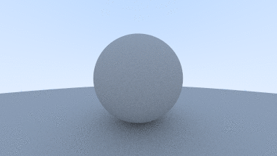
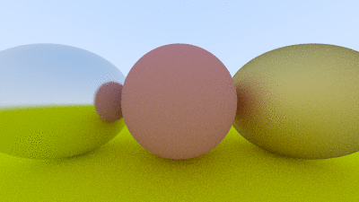
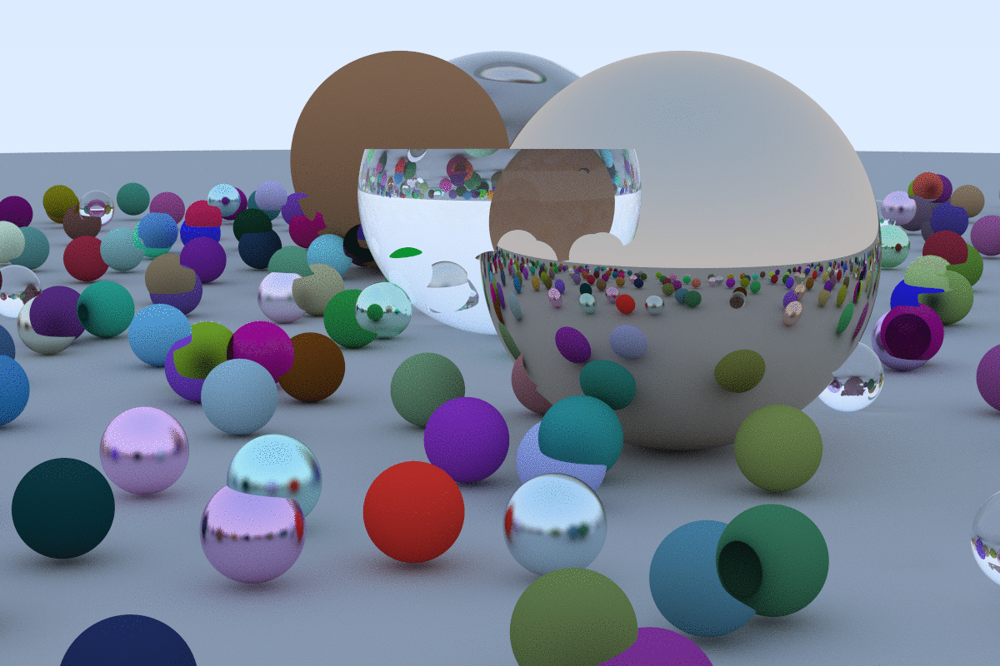

# RayTracer
Java implementation of a Ray Tracer (technically a Path Tracer) from the book [Ray Tracing in One Weekend](https://github.com/RayTracing/raytracing.github.io).

### Progress pictures from along the way

    
    

---

### Final render

Admittedly it is not what the final scene should look like...\
But I suspect that it's due to something small, like a mistaken vector product somewhere, shouldn't be too big of a deal :D